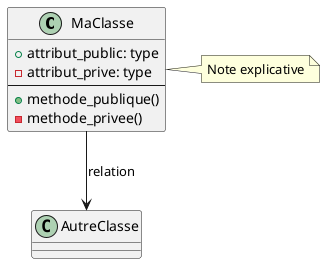

# Diagrammes UML - Documentation Technique

Ce dossier contient les diagrammes PlantUML expliquant l'architecture et le fonctionnement du système INS + VOR/DME avec EKF adaptatif.

## Fichiers

### 1. architecture.puml
**Diagramme de classes - Architecture modulaire**

Montre:
- Classes de configuration (ParametresSimulation, ParametresINS, etc.)
- Modèles physiques (Station, ModelesDynamique, ModelesMesure)
- Algorithmes (EKF, SimulateurINS, GenerateurTrajectoire)
- Métriques et visualisation

Relations entre modules et notes sur innovations clés.

### 2. flux_ekf.puml
**Diagramme d'activité - Boucle EKF**

Détaille:
- Étape de prédiction (propagation état + covariance)
- Étape de correction (innovation + gain Kalman)
- Adaptations (contrainte vitesse, Q adaptatif, gating hybride)
- Tests conditionnels et gestion rejets

### 3. modes_vol.puml
**Diagramme d'états - Modes de vol**

Présente:
- 3 états (Croisière, Virage Modéré, Manœuvre Agressive)
- Transitions automatiques basées sur ω_z et a_long
- Paramètres EKF par mode
- Scénarios typiques

## Génération des Diagrammes

### Prérequis

Installer PlantUML:
```bash
# Windows (avec Chocolatey)
choco install plantuml

# Linux/Mac
brew install plantuml

# Ou télécharger JAR
wget https://sourceforge.net/projects/plantuml/files/plantuml.jar
```

### Génération PNG

```bash
# Depuis le dossier docs/
java -jar plantuml.jar *.puml

# Ou avec commande installée
plantuml *.puml
```

Génère:
- `architecture.png`
- `flux_ekf.png`
- `modes_vol.png`

### Génération SVG (vectoriel)

```bash
plantuml -tsvg *.puml
```

### Intégration Markdown

```markdown


```

## Visualisation en Ligne

Sans installer PlantUML, visualiser sur:
- http://www.plantuml.com/plantuml/uml/
- https://plantuml-editor.kkeisuke.com/

Copier-coller le contenu des fichiers .puml.

## Modification

Les fichiers .puml sont du texte brut. Éditer avec n'importe quel éditeur.

### Syntaxe PlantUML



## Intégration IDE

### VS Code
Extension: PlantUML (jebbs.plantuml)
- Prévisualisation en temps réel (Alt+D)
- Export automatique

### IntelliJ/PyCharm
Plugin: PlantUML integration
- Prévisualisation intégrée
- Autocomplétion

## Documentation Complète

Pour l'analyse détaillée du code, voir:
- `../ANALYSE_CODEBASE.md` - Analyse complète avec explications
- `../README.md` - Documentation principale
- `../GUIDE_VALIDATION.md` - Guide de validation

## Auteur

Nicolas CUSSEAU - ENSTA ILEMS
Projet SAFRAN - Décembre 2025
